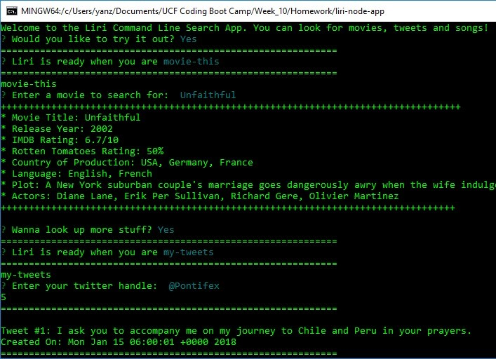

# LIRI Node App

LIRI - which stands for Language Interpretation and Recognition Interfaace - is a command line node app that takes in parameters and returns data to the user. Users are able to search Spotify for song information, Twitter for the tweets associated with an entered screen-name, and IMDB for details about a movie s/he input.

This app was developed to practice the use of Node.js and the Node Package Manager (NPM), and utilzed the following packages:

* File System - a core node package for interacting with files

* Request NPM package - for making http calls

* Twitter NPM package - an asynchronous client library for the Twitter REST and Streaming APIs

* Node-spotify-api - a straightforward API library for the Spotify REST API

* Dotenv - to load environment variables from a .env file into process.env, so that configuration can be stored separate from code

* Inquirer - a collection of common interactive command line user interfaces, such as menus/lists, confirms, passwords and imput. Provides a handy alternative to the global process object for handling user input, as it facilitates easy parsing, validation of input, provision of error feedback and management of session flow.

Below is a screenshot of my LIRI Node App in action:

